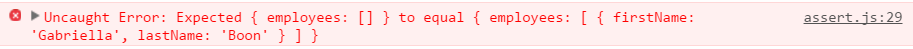
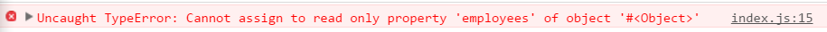

# First reducer

For this section I am going to use a bare bones JavaScript project just to demonstrate the concepts of Redux in the dev tools console. To get this code run
the following:

```
git clone https://github.com/justsayno/redux-examples
git checkout step-1
```

> Now if you run this in the browser and open the developer tools console you will see things printed
> out there

The first thing to get your head around with Redux is the idea of pure and impure functions. A pure functions is one that does not have 
any observable side effects. Side effects can include things like database calls, or network requests, or mutation of parameters passed in.

I am going to use the example [previous step](00-2-Redux.md) where we want to handle the 'EMPLOYEES_REQUESTED' action. This is my
employee reducer in `src/index.js`:

``` javascript
const employeeReducer(state, action) => {
	return state
}
```
Obviously this is not actaully doing anything yet and it won't be able to handle the `EMPLOYEES_REQUESTED` action. 

## Testing our reducer

Before I finish implementing my reducer I am going to add a unit test using [Michael Jackson's Expect Library](https://github.com/mjackson/expect) that should 
pass when we have finished our reducer for this actions:

```
git checkout step-1-1
```

``` javascript
import expect from 'expect'

export const employeeReducer = (state, action) => {
	return state
}

const testRequestEmployees = () => {
	const stateBefore = {
		employees: []
	}
  const stateAfter = {
		employees: [{
			firstName: 'Gabriella',
			lastName: 'Boon'
		}]
	}
	expect(employeeReducer(stateBefore)).toEqual(stateAfter)
}

testRequestEmployees()

console.log('All tests passed')
```

This `testRequestEmployees()` method is just creating the `stateBefore` and `stateAfter` and saying that the result of calling
the employeeReducer with the state before and the `EMPLOYEES_REQUESTED` action should equal the state after we expect.

If you open up the address http://localhost:8080 in your browser you should see the following in the developer
console:



We haven't implemented the handler for our action so it fails... Lets fix this.

```
git checkout step-1-2
```

Now you will see in `src/index.js` that our reducer looks like this:

``` javascript
export const employeeReducer = (state, action) => {
	if (action.type === 'EMPLOYEES_REQUESTED') {
		state.employees = getEmployees()
	}
	return state
}
```

And if you run it in the browse you should see the text 'All tests passed' in the console.

## Reducers must be pure functions

While while this passes the test we have broken the second principal of Redux: state is read-only. I am going to
import the library [deepFreeze](https://github.com/substack/deep-freeze) to help me. This library basically makes
objects immutable and will either throw and error or do nothing if you try to mutate the affected object.

```
git checkout step-1-3
```

Now my test looks like this:

``` javascript
const testRequestEmployees = () => {
	const action = {
		type: 'EMPLOYEES_REQUESTED'
	}
	const stateBefore = {
		employees: []
	}

	const stateAfter = {
		employees: [{
			firstName: 'Gabriella',
			lastName: 'Boon'
		}]
	}

	deepFreeze(stateBefore)

	expect(employeeReducer(stateBefore, action)).toEqual(stateAfter)
}
```

If you look in the developer console you will see this:



We might be producing the correct result but we have mutated the state. We need to use `Object.assign` to avoid
doing this by creating a new state object.

```
git checkout step-1-4
```

``` javascript
export const employeeReducer = (state, action) => {
	if (action.type === 'EMPLOYEES_REQUESTED') {
		return Object.assign({}, state, {
			employees: getEmployees()
		})
	}
	return state
}
```

All I've done here is instead of modifying the state itself I have used the [Object.assign](https://developer.mozilla.org/en/docs/Web/JavaScript/Reference/Global_Objects/Object/assign) 
method to merge the old state with a new state. How this function works is it takes an object as the first argument and merges each subsequent argument into it, returning one
object. The properties are overriden by each successive merge so in my reducer I have created a NEW object `{}`, merged in the current state then merged in my new state.

Test passes! Lets create our Redux store

Next step - [Click here](02-First-Store.md)


