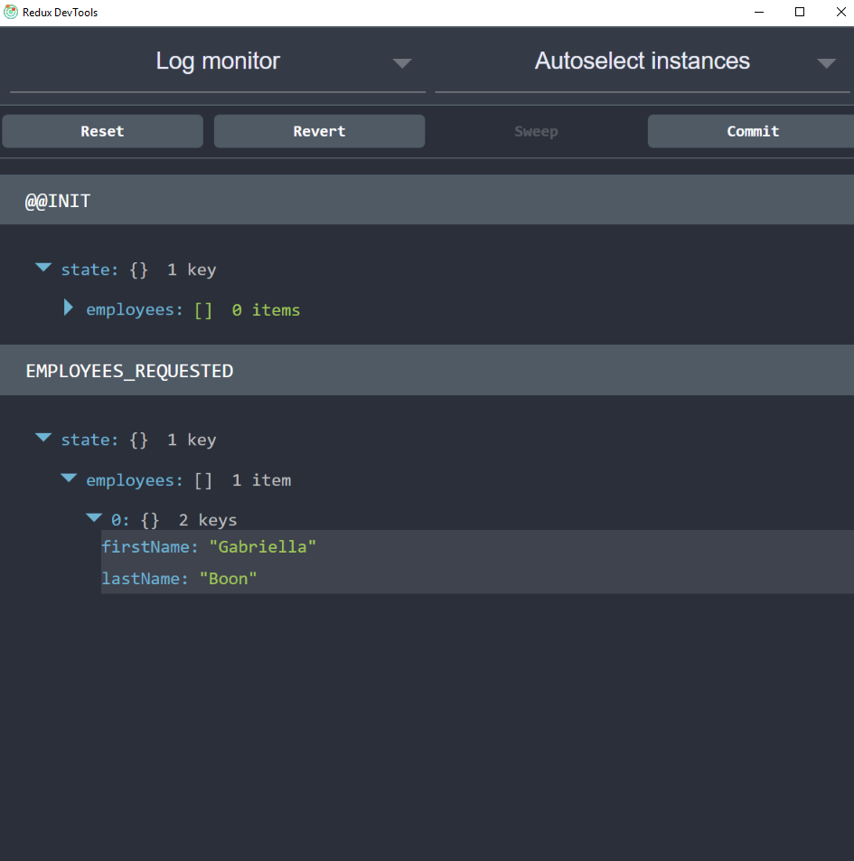

# Our first store

```
git checkout step-2
```

Now that we have a employee reducer that successfully passes our test its time to bring in 
Redux and create our store.

If you look at `src/index.js` the first thing you'll notice is I have added an import:

``` javascript
import { createStore } from 'redux'
```

I have installed the `redux` package from npm, imported the `createStore` function and at the bottom on 
the file I use `createStore` which takes a reducer and returns a Redux store:

```
let store = createStore(employeeReducer)
```

## What is a store?

A store is your reference to the Redux store which holds your application state. It has 3 methods of interest here:

### `getState`

Get the current state of the Redux store.

### `disptach(action)`

Dispatch a particular action (object with a non-null string property `type`)

### `subscribe(listener)`

Subscribe a listener (callback) tgit brancho be run when there are updates to the application state. Returns
a function that can be used to de-register the listener,

## Initial state

The last thing I need to do with our store setup the initial state. At the moment in my reducer I am returning
the state passed in but I'm not passing anything into that function when I register my store.

```
git checkout step-2-1
```

I could put something logic in my reducer to fix this but instead I have used ES2015 default parameters:

``` javascript
const initialState = {
	employees: []
}

export const employeeReducer = (state = initialState, action) => {
  if (action.type === 'EMPLOYEES_REQUESTED') {
    return Object.assign({}, state, {
      employees: getEmployees()
    })
  }
	return state
}
```

## Using our Redux store

In reality you wouldn't probably use a real store instance and write a unit test against it.
You would probably just leave the test as I have done just testing the reducer. But for 
demonstration purposes I'm going to update my test to use my real Redux store.

```
git checkout step-2-2
```

I've updated the test to look like this:

``` javascript
const testRequestEmployees = () => {
	// the action I am dispatching
	const action = {
		  type: 'EMPLOYEES_REQUESTED'
	}
	
	deepFreeze(initialState)
	// create the store
	let store = createStore(employeeReducer)

	// the state that should be there after calling that action
	const expectedState = {
		employees: [{
			firstName: 'Gabriella',
			lastName: 'Boon'
		}]
	}

	// dispatch the action
	store.dispatch(action)

	// check the resulting state returned from getState() is equal to what I expected
	expect(store.getState()).toEqual(expectedState)
}
```
I have created my store and also called `deepFreeze` on the initial state to make sure that I am not
mutating my state.

If you run this in the browser it will print out 'All tests passed' in the console.

### Redux dev tools

```
git checkout step-2-3
```

[Redux Dev Tools](https://github.com/gaearon/redux-devtools/blob/master/docs/Walkthrough.md) let you see the actions and the state at every point in the execution of 
your app. There are two ways you can integrate the dev tools. 

The first and easiest is by installing the [Chrome plugin](https://github.com/zalmoxisus/redux-devtools-extension)
 and change your store registration to this:


``` javascript
	let store = createStore(employeeReducer, window.devToolsExtension && window.devToolsExtension());
```

The second option is to integrate it into your React app but since at this stage I don't have one
then I am going to use the extension. This gives you a monitor into your actions and the 
state. For example

.

Now all this example code is great but lets move into doing it in a real application, carying
on from my [previous tutorial](https://github.com/justsayno/react-introduction-tutorial).

I have forked the old repository and we will be working from that the code. 
It can be found [here](https://github.com/justsayno/redux-react-introduction). More in the next step.

[Next Step](03-Integrating-Redux-And-React.md)