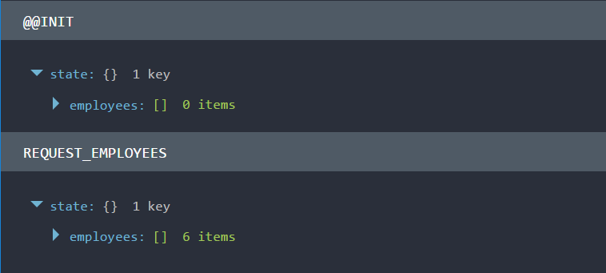

# Actions and Action Creators

```
git checkout step-4
```

As mentioned in the previous step the second argument to `react-redux`'s `connect` function
is `mapDispatchToProps`. This is a function that recieves the store's dispatch function
as an argument and returns an object that is merged into the props of the component. Similar to mapStateToProps
but used for actions and action creators.

This is a very convienent way of decoupling your component from the dispatch function itself.
As you can see in `EmployeeDashbaord` I have done just that. I have created a function that wraps the
dispatching of a `REQUEST_EMPLOYEE` action.

``` javascript
const mapDispatchToProps = (dispatch) => ({
  requestEmployees: () => (dispatch({ type: 'EMPLOYEES_REQUESTED' }))
})
``` 

This can then be called from inside my component. I was this action to happen on the first
render of my container component so I put it in the constructor:

``` javascript
constructor({requestEmployees}){
    super()
    requestEmployees()
}
```

## Action creators

```
git checkout step-4-1
```

Although this is good if I wanted to call that action from else where in my app
I would duplicate the creation of the action. It is a common pattern to create "Action Handlers"
for doing this.

``` javascript
// Actions
const EMPLOYEES_REQUESTED = 'EMPLOYEES_REQUESTED'

// Action Creators
export const requestEmployees = () => ({ 
    type: EMPLOYEES_REQUESTED
})
```

Notice how I have turned my action string into a constant so that I don't have to repeat it all
over the place. 

But there I still have a basic reducer from my earlier step that has
hard coded initial state and no handler for this action! Lets fix this.

``` 
git checkout step-4-2
```

``` javascript
const initialState = {
    employees: []
}
export const employeeReducer = (state = initialState, action) => {
    switch (action.type) {
        case EMPLOYEES_REQUESTED: {
            return Object.assign({}, state, {
                employees: getEmployees()
            })
        }
        default: {
            return state
        }
    }
}
```

I've modified this a little from the previous examples in the first steps as
the switch statement is much nicer to see what is happening and it will scale better
as I add more actions. IF you look in Redux Dev Tools you would see this:



Now lets make this more realistic in the next step and turn the `getEmployees` call
into an async call.

