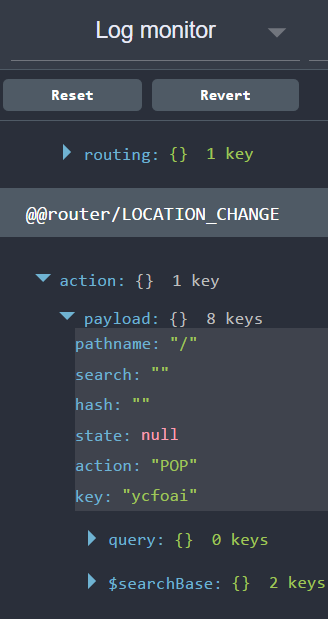

# Multiple Reducers

```
git checkout step-7
```

In the current implementation of our application the data used for the single view and the list view of the employees is the same. I've changed this now
so that the list doesn't have as much detail so we will have to get the employee details when the user navigates there...

What I have done in this stage is three things:

1. Change the mock API so that there are two different calls
2. Added a new PropType called EmployeeSimplified

```
export const EmployeeSimlified = {
    id: PropTypes.string.isRequired,
    firstName: PropTypes.string.isRequired,
    lastName: PropTypes.string.isRequired,
    avatar: PropTypes.string.isRequired,
    role: PropTypes.string.isRequired,
    team: PropTypes.string.isRequired
}
```

3. Updated each of my 'list' view components to use the new `EmployeeSimlified` PropType to avoid any errors.

But now my `EmployeeProfile` view is broken since the data doesn't have all the fields it needs! Lets fix this by adding
our new redux actions and action handler.

## Combine Reducers

Normally at this stage I would seperate things into different files based on the [Fractal Project Structure](https://github.com/davezuko/react-redux-starter-kit/wiki/Fractal-Project-Structure)
but I am leaving that for a later tutorial. For now I am going to leave everything in one file for clarity.

But I am going to add a new branch on our state tree with its own reducer. So far all the data has been at the root level like this:

``` javascript
const initialState = {
    employees: [],
    hasLoaded: false,
    isFetching: false,
    hasError: false,
    error: null
}
```

Now I want to store seperate data about each individual employee. You could find the employee you have viewed and add the extra data into the list, but this gets hard to manage and keep consistent.
Instead Redux gives you a method called `combineReducers` which combines multiple reducers into one so we can pass it to our `createStore`.

Each reducer manages a seperate part of the state. For example:

``` javascript
const employeesInitialState = {
    employees: [],
    hasLoaded: false,
    isFetching: false,
    hasError: false,
    error: null
}ror: null
}

const selectedEmployeeInitialState = {
    employee: null,
    hasLoaded: false,
    isFetching: false,
    hasError: false,
    error: null
}
```

```
git checkout step-7-1
```

In this step I have added all the required code to create the actions, action creators, the seperate reducers and using combine reducers to bring it all together.
It might seem like a lot of code but in my more advanced tutorial that will follow this one I will demonstrate how you can generalise a lot of this code to reduce the boilerplate.

``` javascript
import { createStore, applyMiddleware, compose, combineReducers } from 'redux';
import thunk from 'redux-thunk';
import { getEmployees, getEmployee } from './api/employees'

// Actions
const EMPLOYEES_REQUESTED = 'EMPLOYEES_REQUESTED'
const EMPLOYEES_RECEIVED = "EMPLOYEES_RECEIVED"
const EMPLOYEES_ERROR_RECEIVED = "EMPLOYEES_ERROR_RECEIVED"

const EMPLOYEE_SELECTED = 'EMPLOYEE_SELECTED'
const EMPLOYEE_RECEIVED = "EMPLOYEE_RECEIVED"
const EMPLOYEE_ERROR_RECEIVED = "EMPLOYEE_ERROR_RECEIVED"

// employees action creators
export const employeesRequested = () => ({
    type: EMPLOYEES_REQUESTED
})

export const employeesReceived = (employees) => ({
    type: EMPLOYEES_RECEIVED,
    employees: employees
})

export const employeesErrorReceived = (error) => ({
    type: EMPLOYEES_ERROR_RECEIVED,
    error: error
})

export const requestEmployees = () => {
    return (dispatch, getState) => {
        const { hasLoaded, isFetching } = getState()
        if( hasLoaded || isFetching ) return
        
        dispatch(employeesRequested())
        return getEmployees().then(
            (employees) => dispatch(employeesReceived(employees)),
            (error) => dispatch(employeesErrorReceived(error))
        )
    }
}

// selected employee action creators
export const employeeSelected = (employeeId) => ({
    type: EMPLOYEE_SELECTED,
    employeeId: employeeId
})

export const employeeReceived = (employee) => ({
    type: EMPLOYEE_RECEIVED,
    employee: employee
})

export const employeeErrorReceived = (error) => ({
    type: EMPLOYEE_ERROR_RECEIVED,
    error: error
})

export const requestEmployee = (employeeId) => {
    return (dispatch, getState) => {
        const { hasLoaded, isFetching } = getState()
        if( hasLoaded || isFetching ) return
        
        dispatch(employeeSelected(employeeId))
        return getEmployee(employeeId).then(
            (employee) => dispatch(employeeReceived(employee)),
            (error) => dispatch(employeeErrorReceived(error))
        )
    }
}

// initial state of the employee reducer
const employeesInitialState = {
    items: [],
    hasLoaded: false,
    isFetching: false,
    hasError: false,
    error: null
}

// employees reducer
export const employeeReducer = (state = employeesInitialState, action) => {
    switch (action.type) {
        case EMPLOYEES_REQUESTED: {
            return Object.assign({}, state, {
                items: [],
                hasLoaded: false,
                isFetching: true,
                hasError: false,
                error: null
            })
        }
        case EMPLOYEES_RECEIVED: {
            return Object.assign({}, state, {
                items: action.employees,
                hasLoaded: true,
                isFetching: false,
                hasError: false,
                error: null
            })
        }
        case EMPLOYEES_ERROR_RECEIVED: {
            return Object.assign({}, state, {
                items: [],
                hasLoaded: true,
                isFetching: false,
                hasError: true,
                error: action.error
            })
        }
        default: {
            return state
        }
    }
}

// initial state of the selected employee reducer
const selectedEmployeeInitialState = {
    item: null,
    hasLoaded: false,
    isFetching: false,
    hasError: false,
    error: null
}

// selected employee reducer
export const selectedEmployeeReducer = (state = selectedEmployeeInitialState, action) => {
    switch (action.type) {
        case EMPLOYEE_SELECTED: {
            return Object.assign({}, state, {
                item: null,
                hasLoaded: false,
                isFetching: true,
                hasError: false,
                error: null
            })
        }
        case EMPLOYEE_RECEIVED: {
            return Object.assign({}, state, {
                item: action.employee,
                hasLoaded: true,
                isFetching: false,
                hasError: false,
                error: null
            })
        }
        case EMPLOYEE_ERROR_RECEIVED: {
            return Object.assign({}, state, {
                item: null,
                hasLoaded: true,
                isFetching: false,
                hasError: true,
                error: action.error
            })
        }
        default: {
            return state
        }
    }
}

const rootReducer = combineReducers({
    employees: employeeReducer,
    selectedEmployee: selectedEmployeeReducer
})

const initialState = {
    employees: employeesInitialState,
    selectedEmployee: selectedEmployeeInitialState
}

export const store = createStore(
  rootReducer,
  initialState,
  compose(
    applyMiddleware(thunk),
    window.devToolsExtension ? window.devToolsExtension() : f => f
    )
)
```

Lets call this new `selectEmployee` action from our `EmployeeProfile` component to get it working again.

```
git checkout step-7-2
```

I have now changed my EmployeeProfile to remove the logic for getting the selected employee from the state to instaed call `selectEmployee` action creator:

``` javascript
componentWillMount () {
    const { selectEmployee, params: { employeeId }  } = this.props
    selectEmployee(employeeId)
}
```

Otherwise this is very similar.

## Dealing with stale state.

The only problem now is that once an employee is selected it doesn't stays selected. Since when the route parameters change in the `Route` component the 
`EmployeeProfile` component will remount the `componentWillMount` function will run again.

Unfortunately if we look at our current implementation for the `requestEmployees` it will return is `hasLoaded` is true so it won't re-fetch an employee
once its loaded it once. 

``` javascript
export const requestEmployee = (employeeId) => {
    return (dispatch, getState) => {
        const { hasLoaded, isFetching } = getState()
        if( hasLoaded || isFetching ) return
        
        dispatch(employeeSelected(employeeId))
        return getEmployee(employeeId).then(
            (employee) => dispatch(employeeReceived(employee)),
            (error) => dispatch(employeeErrorReceived(error))
        )
    }
}
```

What we need to do make sure that if the employeeId passed in is **different** to the one `selectedEmployee.item.id` in the state
then we let it continue and request the employee from the api.

```
git checkout step-7-3
```
Now I have re-written my `requestEmployee` action creator to look like this:

``` javascript
export const requestEmployee = (employeeId) => {
    return (dispatch, getState) => {
        const state = getState()
        const { hasLoaded, isFetching } = state.selectedEmployee
        if(isFetching || (hasLoaded && employeeId === state.selectedEmployee.id)) return
        
        dispatch(employeeSelected(employeeId))
        return getEmployee(employeeId).then(
            (employee) => dispatch(employeeReceived(employee)),
            (error) => dispatch(employeeErrorReceived(error))
        )
    }
}
```

The logic here is saying "if it is fetching **OR** it has loaded and the selectedEmployee id in the state is the same as the employee id requested then don't do anything".

## Adding Redux router

```
git checkout step-7-4
```

So far our store has only contained state relating employees and not the state that relates to the URL of the app. We can do this using `redux-react-router` which basically enhances
`react-router` to ensure it updates the Redux store when there are changes made. If you look in the `src/store.js` file I have imported `routerReducer` from `react-router-redux`:

``` javascript
import { routerReducer } from 'react-router-redux'
```

And added it to my combine reducer function:

``` javascript
const rootReducer = combineReducers({
    employees: employeeReducer,
    selectedEmployee: selectedEmployeeReducer,
    routing: routerReducer
})
```

Then I need use another function called `syncHistoryWithStore` from `react-router-redux` that builds a new history object for you to pass to your `Router` component. My Updated
routes.js looks like this:

``` javascript
import React from 'react'
import { Router, Route, IndexRoute, browserHistory  } from 'react-router'

// Main App Container
import App from './App'

import EmployeeDashboard from './containers/EmployeeDashboard'
import EmployeeProfile from './containers/EmployeeProfile'
import { syncHistoryWithStore } from 'react-router-redux'

const Routes = ({store}) => (
    <Router history={syncHistoryWithStore(browserHistory, store)}>
        <Route path='/' component={App}>
            <IndexRoute component={EmployeeDashboard} />
            <Route path='/dashboard' component={EmployeeDashboard} />
            <Route path='/employee/:employeeId' component={EmployeeProfile} />
        </Route>
    </Router>
)

export default Routes
```

As you can see I am now passing my store as `props` and then passing the regular `browserHistory` and my store to `syncHistoryWithStore` and passing that result to my
Router component as the history prop. Of course I had to edit my render function to pass the store in:

``` javascript
ReactDOM.render(
  <Provider store={store}>
    <Routes store={store}/>
  </Provider>,
  document.getElementById('root')
)

```

Now if you run the app and look in the Redux DevTools you'll see the route changes in there:

